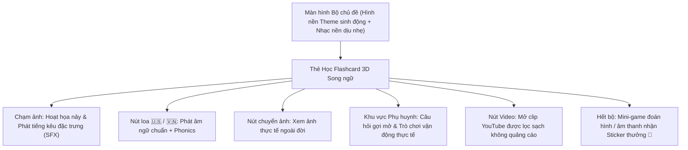

# TIÊU CHUẨN THIẾT KẾ BỘ HỌC PHẦN ĐA GIÁC QUAN (KIDS WORLD SPECIFICATION)

Khung thiết kế 4 thành phần nền tảng:
1. **Background**: Dùng làm hình nền chủ đề cho bộ học phần.
2. **Thẻ nội dung song ngữ Anh - Việt**: Tên gọi, từ vựng và phiên âm.
3. **Nội dung mô tả chi tiết cho phụ huynh**: Hỗ trợ cha mẹ tương tác, giải thích và chơi cùng bé.
4. **Video YouTube**: Video sinh động, an toàn và bổ trợ kiến thức.

---

## 1. CÁC THÀNH PHẦN MỞ RỘNG ĐA GIÁC QUAN & KẾT NỐI CHA MẸ - BÉ

Nhằm giúp trẻ nhỏ (độ tuổi 2–7 tuổi) tiếp thu tự nhiên qua đa giác quan và sự tò mò, bộ học phần được chuẩn hóa bổ sung 6 thành phần chuyên sâu:

### A. Âm thanh thực tế (Real Sound Effects - SFX)
* Trẻ nhỏ ghi nhớ qua âm thanh tự nhiên trước khi nhớ mặt chữ.
* Ngoài việc phát âm chữ *"Tiger / Con hổ"*, cần có nút **Âm thanh đặc trưng**:
  * *Chủ đề Động vật:* Tiếng gầm của hổ, tiếng voi rống, tiếng chim hót.
  * *Chủ đề Phương tiện:* Tiếng còi xe cứu hỏa, tiếng động cơ máy bay, tiếng chuông xe đạp.
  * *Chủ đề Tự nhiên:* Tiếng mưa rơi róc rách, sấm chớp, sóng biển.

### B. Cặp ảnh Chuyển đổi: "Minh họa 3D/Vẽ" ⟷ "Ảnh chụp thực tế" (Real Photo Mode)
* **Vấn đề thường gặp:** Bé nhìn hình hoạt hình rất quen thuộc nhưng ra đời thực lại không nhận ra con vật hay đồ vật đó.
* **Giải pháp:** Mỗi thẻ có **2 chế độ ảnh**:
  1. *Hình vẽ hoạt họa/3D:* Dễ thương, nhiều màu sắc để bé có cảm tình.
  2. *Hình ảnh đời thực chất lượng cao:* Giúp bé liên hệ trực tiếp với thế giới xung quanh. Có nút chạm chuyển đổi mượt mà giữa 2 hình.

### C. Hoạt họa tương tác khi chạm (Micro-interactions / Tap to React)
* Trẻ con rất thích "chạm và phản hồi".
* Khi bé chạm vào hình minh họa: Hình nảy nhẹ (bouncy elastic animation), nhân vật nháy mắt, vẫy đuôi, xoay nhẹ kèm hiệu ứng âm thanh vui tai (*"Boing"*, *"Pop"*).

### D. Hỗ trợ Phonics & Đánh vần trực quan
* Với Tiếng Anh: Hiển thị chữ cái đầu tiên kèm phát âm ngữ âm (Phonics). Ví dụ: `L` - `/l/` - `Lion`.
* Giúp bé liên kết chữ cái đầu với từ vựng mà không bị quá tải.

### E. "Cẩm nang kết nối" dành riêng cho Cha mẹ (Parent-Child Interaction Hints)
Phần mô tả chi tiết được cấu trúc thành 3 khối Bento sư phạm ngắn gọn:
1. **Fun Fact (Sự thật thú vị):** 1–2 câu bất ngờ (ví dụ: *"Lưỡi của hươu cao cổ dài tận 45cm và có màu xanh đen để không bị cháy nắng đấy!"*).
2. **Câu hỏi gợi mở (Conversation Starter):** Câu hỏi để cha mẹ đố bé (ví dụ: *"Đố con biết bạn Sư tử có bờm là sư tử bố hay sư tử mẹ?"*).
3. **Thử thách vận động ngoài đời (Kinesthetic Action):** Đưa bé rời màn hình để tương tác thể chất (ví dụ: *"Hai mẹ con mình cùng nhảy lò cò như chú chuột túi nào!"*).

### F. Mini-game củng cố cuối bộ (Gamification & Kiểm tra nhẹ nhàng)
Sau khi lướt qua hết các thẻ trong bộ, app tự động mở một thử thách nhỏ 30 giây:
* **Đoán tiếng kêu:** Phát ra tiếng còi tàu ➜ Bé chọn 1 trong 3 xe.
* **Tìm hình theo từ:** *"Where is the Apple?"* ➜ Bé chạm vào quả táo.
* Khi làm đúng: Thưởng **Sticker ảo / Ngôi sao ⭐** để bé dán vào "Bộ sưu tập thám hiểm" của mình kèm pháo hoa (Confetti).

---

## 2. CHUẨN CẤU TRÚC DỮ LIỆU ĐỀ XUẤT CHO 1 BỘ (TOPIC PACK SCHEMA)

```json
{
  "topic_id": "animals_safari",
  "title_vi": "Động Vật Hoang Dã",
  "title_en": "Safari Animals",
  "theme_background": "assets/themes/safari_bg.png",
  "theme_ambient_audio": "assets/audio/safari_ambient.mp3",
  "items": [
    {
      "id": "item_lion",
      "name_vi": "Sư tử",
      "name_en": "Lion",
      "phonics_en": "L - /l/ - Lion",
      "images": {
        "illustration": "assets/items/lion_vector.png",
        "real_life": "assets/items/lion_real.jpg"
      },
      "audio": {
        "pronounce_vi": "assets/audio/vi/su_tu.mp3",
        "pronounce_en": "assets/audio/en/lion.mp3",
        "sfx_real": "assets/audio/sfx/lion_roar.mp3"
      },
      "parent_guide": {
        "fun_fact": "Sư tử là loài mèo lớn duy nhất sống theo đàn. Sư tử đực có chiếc bờm xù rất oai phong!",
        "open_question": "Đố con tiếng gầm của sư tử to như thế nào?",
        "offline_activity": "Cùng tạo dáng sư tử và gầm vang nhà nào!"
      },
      "youtube_video_id": "7NMh_w4h5z0"
    }
  ]
}
```

---

## 3. LUỒNG TRẢI NGHIỆM ĐA GIÁC QUAN TRÊN ỨNG DỤNG MOBILE


